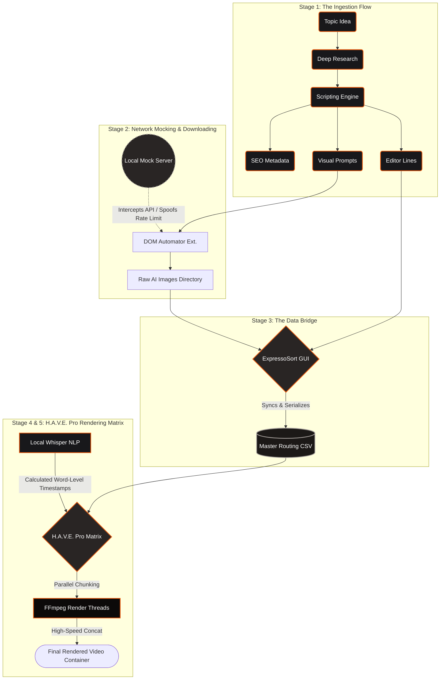

# Systems Architecture: Autonomous Media Generation Pipeline

**Philosophy:** *"What I wanted, I designed. What I needed, I engineered. I treat AI not as a replacement for coding, but as a high-level compiler—the true engineering lies in how you architect the system."*..

## // The Engineering Objective

The traditional video editing is highly manual and takes too much time.. constant track-snapping, manual audio syncing, and doing the same visual placements over and over.. My main goal was to reduce a 20-hour manual work into a clean data pipeline..

By building local Python tools (PySide6, FFmpeg, Whisper) and custom network mock-servers, I turned video editing from a visual timeline task into a structured data task.. human input is only needed for curation and checking quality..

---

## // Visual System Architecture

The following flowchart outlines the data routing from the initial topic generation down to the final multi-threaded FFmpeg render.

---

## // Pipeline Breakdown

### Stage 1: Ingestion (`engine.md`)

The pipeline starts at Step 0, to make highly structured raw materials.. Instead of using simple chat prompts, I engineered a strict prompt architecture (`engine.md`) that acts as a cascade pipeline:

1. **Topic Generation:** Finding niche concepts..
2. **Deep Research:** Gathering actual facts for the topic..
3. **Scripting Engine:** Drafting the core script based on research parameters..
4. **Data Splitting:** The final script is programmatically split into three outputs:
* **Editor Lines:** Script chunked into isolated strings..
* **Visual Prompts:** Prompts optimized for Image/Video generation..
* **SEO Payload:** Auto-generates tags, descriptions, and hashtags..

### Stage 2: Local Network Mocking & Asset Generation

To automate downloading visual assets, I used a third-party DOM-automation extension.. But the tool added a strict server-side rate limit (10 actions) when my workflow needs 250+ actions..

**The AI Failure vs My Solution:**

* I first tried using LLM to decompile and patch the extension's JavaScript.. The AI wanted to rewrite the core logic, which was a dumb fix.. It broke the extension and would require fixing it again on every update..
* **My Solution:** Instead of fighting the extension code, I intercepted the network layer.. I did some protocol analysis on the extension's Supabase database calls and built a simple local Python mock-server.. By rerouting the server handshake via `localhost`, I spoofed the Pro response.. This made an update-proof bypass, restoring unlimited automation without touching the extension code..

### Stage 3: The ExpressoSort Data Bridge

Unstructured images from the web cannot be processed by an automated video engine.. I built **ExpressoSort** in PySide6 to fix this..

* **State-Driven UI:** A visual carousel showing three states: `[Past Asset]` (Left), `[Active Asset]` (Center), and `[Upcoming Asset]` (Right)..
* **Automated Indexing:** Ingests the generated visuals and maps them directly to the chronological "Editor Lines" from Stage 1..
* **Payload Serialization:** Once sorted, ExpressoSort compiles a master CSV.. This CSV serves as the final timeline blueprint, structured as `[Absolute_Image_Path] | [Script_Line_String]`..

### Stage 4: H.A.V.E. Pro Render Matrix & NLP Sync

H.A.V.E. Pro is a custom offline editor built in PySide6.. Instead of a horizontal timeline, it uses a chart-based rendering matrix.. It forces the system to treat the video as a list of deterministic data..

* **NLP Synchronization:** Integrates Whisper model locally.. The engine checks Whisper transcripts against the text in the CSV, to calculate absolute `[Start]` and `[End]` cut times down to the millisecond..
* **Dynamic Captioning:** Uses Whisper's word-level timestamps to programmatically generate active word highlight effects.. This replicates high-engagement subtitles, without needing manual work or paid external APIs..
* **Silence Truncation:** Finds and removes dead air based on Whisper timestamp gaps, compressing the timeline automatically for better retention..
* **State-Driven Inspector:** A property panel allows clip-level overrides, like entry transitions, random pan/zoom animations, cropping, and subtitle visibility..

### Stage 5: Multi-Threaded FFmpeg Assembly

Rendering complex effects via one massive FFmpeg filtergraph often causes memory leaks and crashes.. H.A.V.E Pro runs a stable render queue:

1. **Parallel Chunking:** The Python engine spawns parallel threads to render each clip individually, applying pan/zoom animations and trimming to the exact Whisper timestamps..
2. **High-Speed Concatenation:** Uses an FFmpeg `concat` demuxer to stitch the chunks together seamlessly..
3. **Payload Injection:** Master audio and subtitle streams are merged into the final video container..

### Stage 6: Pre-Flight Optimization (PyThumb-Optimizer)

To finalize deployment, I built a secondary PySide6 utility to bypass manual web-tool bottlenecks like Canva paywalls.. It programmatically crops, resizes, and compresses the generated thumbnails to meet strict platform constraints, guaranteeing sub-2MB file sizes and correct aspect ratios..
