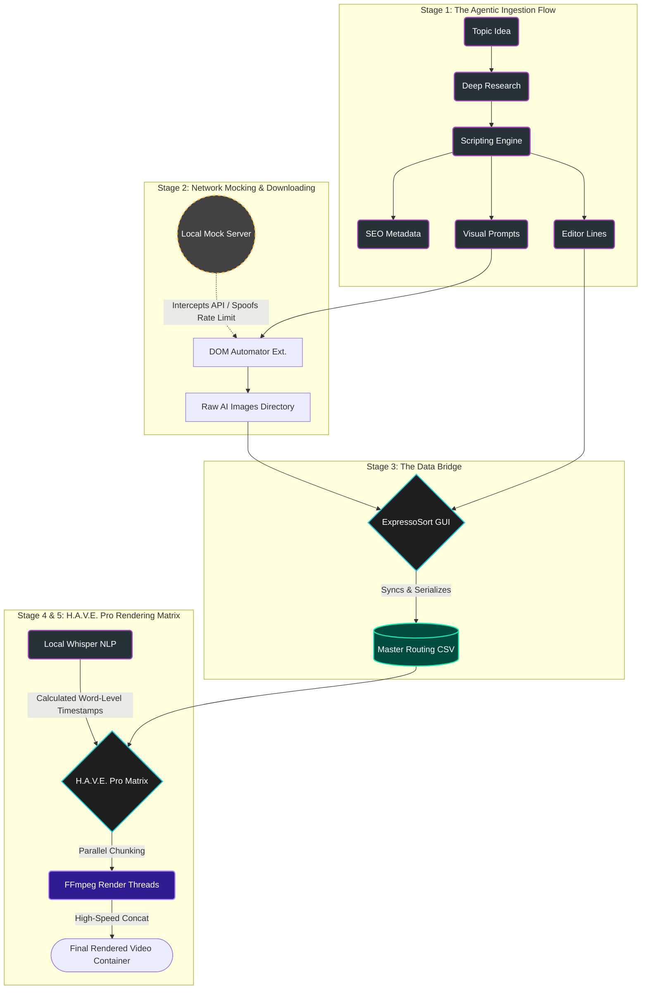

# Systems Architecture: Autonomous Media Generation Pipeline

**Philosophy:** *"What I wanted, I designed. What I needed, I engineered. I treat AI not as a replacement for coding, but as a high-level compiler—the true engineering lies in how you architect the system."*

## // The Engineering Objective

The traditional video editing workflow is highly manual and computationally inefficient, requiring constant track-snapping, manual audio syncing, and repetitive visual placements. My objective was to reduce a 20-hour manual production cycle into a deterministic, semi-autonomous data pipeline.

By engineering a suite of local Python tools (PySide6, FFmpeg, Whisper) and custom network mock-servers, I transformed video editing from a visual timeline task into a **structured data processing task**, reducing human involvement strictly to high-level curation and quality control.

---

## // Visual System Architecture

The following flowchart outlines the complete data routing from the initial topic generation down to the final multi-threaded FFmpeg render.

---

## // Pipeline Breakdown

### Stage 1: Agentic Ingestion (`engine.md`)

The pipeline begins at "Step 0" by systematically generating highly structured raw materials. Instead of using generic chat prompts, I engineered a rigid prompt architecture (`engine.md`) that acts as a cascading logic pipeline:

1. **Topic Generation:** Identifying and iterating on high-performing niche concepts.
2. **Deep Research:** Gathering factual grounding for the chosen topic.
3. **Scripting Engine:** Drafting the core narrative based on research parameters.
4. **Data Splitting:** The final script is then programmatically split into three distinct outputs:
* **Editor Lines:** The script is chunked into exact, isolated strings (e.g., "Line 1: Hello").
* **Visual Prompts:** Generates specific prompts optimized for Image/Video AI engines (like Google Whisk/ImageFX).
* **SEO Payload:** Auto-generates exact tags, descriptions, hashtags, and community post copy.

### Stage 2: Local Network Mocking & Asset Generation

To automate the downloading of visual assets, I utilized a third-party DOM-automation browser extension. However, the tool shifted to a strict server-side rate limit (10 actions) for a workflow requiring 250+ actions per run.

**The AI Failure vs. The Architect's Solution:**

* I initially tested using an LLM to decompile and patch the extension's obfuscated JavaScript. The AI's approach was to rewrite the core logic base. This was a brittle, "dumb" fix—it broke the extension's stability and would require re-patching every time the extension updated.
* **My Solution:** Instead of fighting the application code, I intercepted the network layer. I conducted protocol analysis on the extension's Supabase backend communications and built a lightweight local Python mock-server. By rerouting the server handshake via `localhost`, I spoofed the "Pro Tier" API response. This established a permanent, update-proof bypass, restoring unlimited automation without touching the core extension code.

### Stage 3: The ExpressoSort Data Bridge

Unstructured images downloaded from the web cannot be natively processed by an automated video engine. I built **ExpressoSort** (PySide6) to bridge this gap.

* **State-Driven UI:** A visual carousel displaying three active states: `[Past Asset]` (Left), `[Active Asset]` (Center), and `[Upcoming Asset]` (Right).
* **Automated Indexing:** Ingests the localized folder of generated visuals and maps them directly to the chronological "Editor Lines" from Stage 1.
* **Payload Serialization:** Once curated, ExpressoSort isolates the chosen assets and compiles a master `CSV`. This CSV serves as the definitive timeline blueprint, structured as `[Absolute_Image_Path] | [Script_Line_String]`.

### Stage 4: H.A.V.E. Pro Render Matrix & NLP Sync

H.A.V.E. Pro is a custom offline editor built in PySide6. Instead of a traditional horizontal timeline, it utilizes a **chart-based rendering matrix**, forcing the system to treat the video as a programmable list of deterministic data.

* **NLP Synchronization:** Integrates OpenAI's Whisper model locally. The engine cross-references the Whisper transcripts against the text strings in the CSV to dynamically calculate absolute `[Start]` and `[End]` cut times down to the millisecond.
* **Dynamic Captioning (Active Word Tracking):** Leverages Whisper's precise word-level timestamp data to programmatically generate "active word" highlight effects. This seamlessly replicates high-engagement motion graphics for subtitles without requiring manual keyframing or reliance on paid external APIs.
* **Silence Truncation ("Strict Cuts"):** Algorithmically identifies and removes dead air based on Whisper timestamp gaps, compressing the timeline automatically for better viewer retention.
* **State-Driven Inspector:** A granular property panel allows for clip-level overrides, including entry transitions, random clip animations (pan/zoom), cropping, and subtitle visibility.

### Stage 5: Multi-Threaded FFmpeg Assembly

Rendering complex effects via one massive FFmpeg filtergraph often causes system memory leaks and crashes. H.A.V.E Pro orchestrates a highly stable, enterprise-style render queue:

1. **Parallel Chunking:** The Python engine spawns parallel threads to render each clip individually, applying the requested pan/zoom animations and trimming to the exact Whisper timestamps.
2. **High-Speed Concatenation:** Executes an FFmpeg `concat` demuxer to stitch the isolated chunks together seamlessly.
3. **Payload Injection:** Master audio (merged via Audacity and enhanced via Adobe Podcast) and subtitle streams are multiplexed into the final container.

### Stage 6: Pre-Flight Optimization (PyThumb-Optimizer)

To finalize deployment, I built a secondary PySide6 utility to bypass manual web-tool bottlenecks (like Canva paywalls). It programmatically crops, resizes, and compresses the AI-generated thumbnail concepts to meet strict web platform constraints (guaranteeing sub-2MB file sizes and precise aspect ratios).
